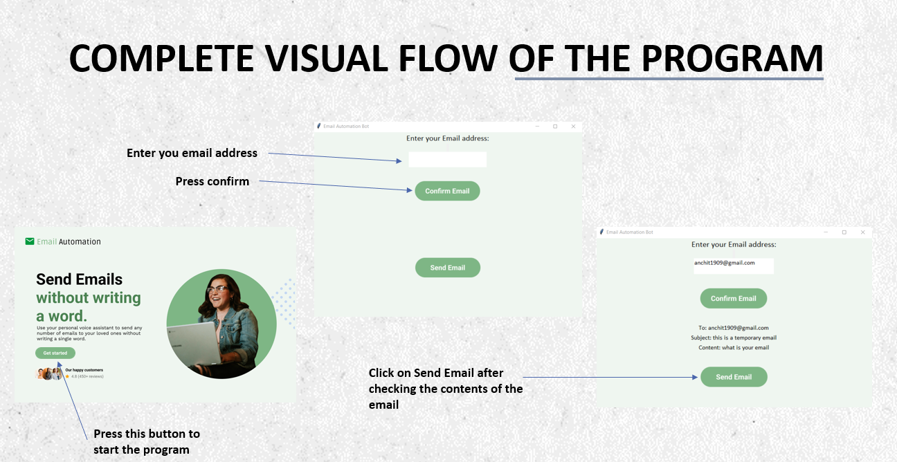

# Email Automation 📨⚡

## Goal for this project

The main objective behind this project is to automate the boring and repetitive task of sending emails.

With an ever-growing demand to communicate with our peers and colleagues in the institute or at jobs, we constantly have to write our emails manually which takes a significant amount of our time.

Even in the times of a global pandemic, the world had to adapt to remote working which drastically increased the need to send emails.

As we can imagine, Python is the ideal companion to send any kind of email automatically with or without our supervision.
By using Python, we can automate the process of sending emails. It’s especially handy when we have to send similar content over and over again. This automation can reduce human errors and free our time as well!

## Tools and Softwares used

* Programming Language Used: **Python** 

* Coding Environment:
**Jupyter Notebook**

* Modules used: 
1. For graphical user interface: **tkinter**
2. To import images: **Image, ImageTk** 
3. To send Email: **smptlib** 
4. To recognize speech from the user: **speech_recognition** 
5. To convert text to speech: **pyttsx3** 
6. To give structure to the email: **from email.message – EmailMessage**
7. To hold calling the function for few seconds: **time** 

* Design Software used: **Figma** 

## Important Terminologies

**SMTP:** Simple Mail Transfer Protocol. It is an internet standard communication protocol for electronic mail transmission.

**TLS:** Transfer Layer Security. It is the successor protocol to SSL. TLS is an improved version of SSL. It works in much the same way as the SSL, using encryption to protect the transfer of data and information.

## Complete Visual Flow of the Program

## Website Preview

